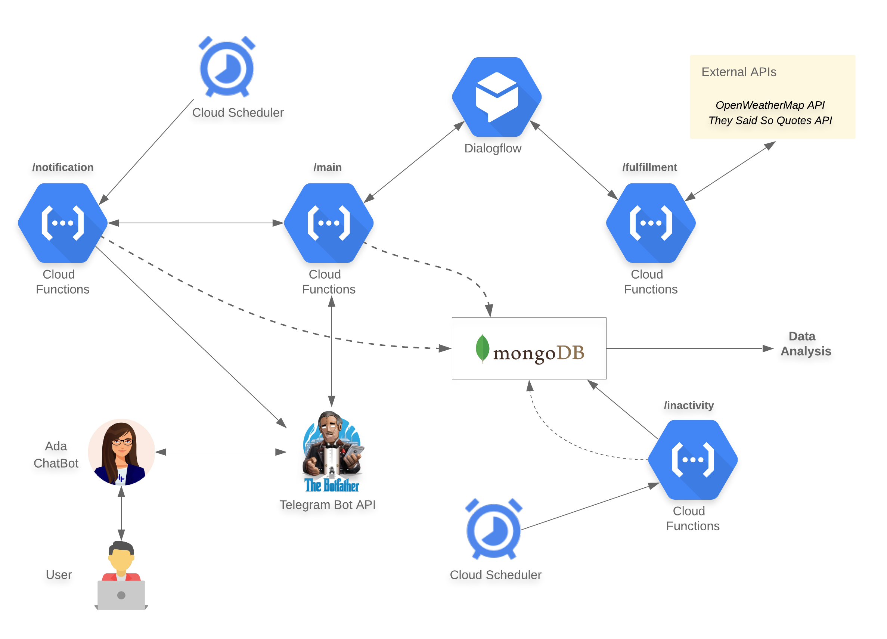

## Proactive Interaction Optimization with Dialog Systems

Ada is a mood tracking conversational agent. 

#### Deployment

1. Telegram Bot API
    - Create a bot via [BotFather](https://core.telegram.org/bots#6-botfather)
    - Save the token 
2. GCP Project
    - Create a GCP project
    - Create an agent in [DialogFlow](https://cloud.google.com/dialogflow/docs/quick/build-agent) and add intents and entities. 
    - Enable the APIs used by the GCP project. Go to _APIs and Services_ and make sure Dialogflow API, Cloud Scheduler API, Cloud Functions API are enabled. 
3. Cloud Functions
    - Install `serverless` framework. See the guide [here](https://www.serverless.com/framework/docs/getting-started/)
    - Run `sls deploy` inside the function folders where the `serverless.yml` is located. This will deploy the functions and print out the summary which includes API endpoints. The endpoints for _mail_ and _fulfillment_ functions will be needed. 
4. Set webhooks
    - Set webhook for the bot using the Telegram Bot API token and [setWebhook](https://core.telegram.org/bots/api#setwebhook) feature. The `url` parameter should be the API endpoint of the _main_ function. From now on, all the incoming messages arrives at the function _main_
    - Set fulfilment webhook. Navigate to DialogFlow and then _Fulfillment_. Select and intent and _Enable webhook call_. Enable webhook and insert the API endpoint of the _fulfillment_ cloud function. Lastly, go to _Intents_ and select the intents that'll need the fulfillment and _Enable webhook call for this intent_. From now on, any utterance from the user with that intent will arrive at the cloud function _fulfillment_. 
5. Make sure to insert credentials below into code
    - OpenWeather API Key
    - Telegram Token
    - MongoDB connection string
    - Google Cloud Pleatform - Service Account Credentials Info
